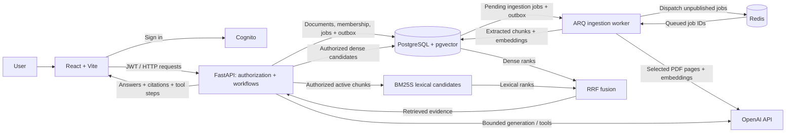

# Retrieval Works

**AI Technical Research & Knowledge Platform**

## Project Overview

Retrieval Works helps users organize technical documents into shared workspaces
and turn them into searchable knowledge with source-cited answers. Users can
upload text and PDFs, search across selected KnowledgeBases, and research
questions while retaining document versions and citation provenance. This AI
engineering portfolio project focuses on measured retrieval quality,
server-enforced authorization, and bounded model workflows.

## Screenshots / Demo

Screenshots and a short authenticated workflow recording are still planned.
To explore the implemented interface, follow the [local setup](#local-setup)
below: upload a document, ask a question, and expand a citation to inspect its
source; the workspace also exposes version history and research tool steps.

## Key Engineering Highlights

- **Server-enforced workspace authorization:** Cognito verifies identity;
  database membership controls roles and data access. Model-selected search
  scopes are re-authorized before execution.
  [Authorization decision](docs/adr/002-workspace-authorization-model.md)
- **Measured hybrid retrieval:** pgvector dense search and BM25S lexical search
  are combined with reciprocal-rank fusion, avoiding incompatible raw-score
  scales. Reviewed evaluations expose where each strategy wins.
  [Retrieval decision](docs/adr/004-bm25s-rrf-hybrid-retrieval.md)
- **Durable ingestion and source provenance:** PostgreSQL commits ingestion jobs
  and outbox events atomically; Redis/ARQ dispatches worker tasks. Immutable
  document versions preserve chunk offsets and PDF page references for citations.
  [Outbox decision](docs/adr/016-transactional-ingestion-outbox.md) ·
  [Versioning decision](docs/adr/003-document-versioning.md)
- **Bounded AI orchestration:** LangGraph loads limited conversation history;
  research enforces a three-tool-call budget, and corrective RAG permits one
  evidence-triggered retry. The UI exposes tool steps and stop reasons.
  [Agent decision](docs/adr/011-bounded-agentic-research-loop.md) ·
  [Correction decision](docs/adr/012-evidence-triggered-single-correction.md)
- **Native-first PDF extraction:** ordinary text stays on a deterministic path;
  only flagged pages use multimodal extraction, with original page provenance
  retained. Reviewed fixtures measure evidence and table-structure retention.
  [Selective-page evaluation](evaluation/reports/2026-09-18-phase-18-selective-pages.md)
- **Cost-aware operations and privacy-bounded telemetry:** a single ARM EC2 host
  keeps the demo topology small; correlated HTTP/AI metrics omit document content.
  This accepts a single point of failure, and SLOs remain targets.
  [AWS architecture](docs/architecture/aws-demo-deployment.md) ·
  [Observability](docs/architecture/observability.md)

## Architecture Diagram



The API owns authorization and persistent-data access; PostgreSQL retains durable
job state while Redis handles dispatch. See the
[system overview](docs/architecture/system-overview.md),
[domain model](docs/architecture/domain-model.md), and
[deployed AWS topology](docs/architecture/aws-demo-deployment.md) for the full
runtime and trust boundaries.

## Evaluation & Trade-offs

### Controlled product corpus

Five documents, eleven chunks, and sixteen reviewed judgments; dense retrieval
uses `text-embedding-3-small`, lexical retrieval uses BM25S, and hybrid uses RRF.

| Metric | BM25 | Dense (pgvector) | Hybrid RRF |
| --- | ---: | ---: | ---: |
| DocumentRecall@1 | 1.000 | 0.875 | 0.938 |
| DocumentMRR@5 | 1.000 | 0.927 | 0.938 |
| EvidenceHit@1 | 1.000 | 0.875 | 0.938 |
| EvidenceHit@3 | 1.000 | 1.000 | 1.000 |

Hybrid improved rank-one retrieval over dense search but did not beat BM25 on
this small, lexical-heavy English corpus. These results do not establish
large-scale or multilingual accuracy.
[Configuration and per-case results](evaluation/reports/2026-09-10-phase-3-hybrid-comparison.md)

### Public retrieval benchmark

Three NanoBEIR tasks, fifty queries each; scores below are **nDCG@10**.
This document-level benchmark evaluates retrieval methods separately from the
product ingestion and chunking pipeline.

| Task | BM25 | Dense | Hybrid RRF |
| --- | ---: | ---: | ---: |
| NanoSciFact | 0.7033 | **0.7647** | 0.7635 |
| NanoNFCorpus | 0.3180 | **0.3869** | 0.3774 |
| NanoHotpotQA | 0.8098 | 0.7898 | **0.8444** |

The best strategy depends on the workload: dense led two tasks, while hybrid led
NanoHotpotQA. No statistical significance test was reported; one fixed RRF
configuration does not establish universal superiority.
[Full benchmark and limitations](evaluation/reports/2026-09-11-nanobeir-three-task-baseline.md)

Other explicit trade-offs include rebuilding BM25 per search for freshness,
provider cost for flagged PDF pages, and a single-node deployment that is not
highly available. See the [evaluation guide](evaluation/README.md),
[engineering case study](docs/case-study.md), and [limitations](#limitations).

## Local setup

### Docker Compose (recommended)

```bash
cp .env.example .env
docker compose up --build
```

Open <http://localhost:5173>. The API health endpoint is available at
<http://localhost:8000/health>.

Stop the stack with:

```bash
docker compose down
```

Add `--volumes` only when you intentionally want to remove local database data.

### Run checks locally

Backend dependencies require Python 3.12 or 3.13:

```bash
cd apps/api
python -m venv .venv
source .venv/bin/activate
pip install -e '.[dev]'
ruff check .
ruff format --check .
mypy
pytest
```

Frontend:

```bash
cd apps/web
pnpm install
pnpm lint
pnpm typecheck
pnpm test
pnpm build
```

## Configuration

Copy `.env.example` to `.env` for local defaults. `.env` is ignored by Git.
Production credentials must be supplied through an appropriate secrets system;
the example values are development-only. Set `OPENAI_API_KEY` to enable live
document ingestion; leave it empty to keep the embedding-backed worker safely
unavailable. `REDIS_URL` configures async job dispatch and defaults to the local
Compose Redis service.
Docker Compose enables a local development-session issuer by default. That
issuer uses an in-memory browser token and a development signing secret; disable
`AUTH_DEVELOPMENT_MODE` and configure a production identity adapter before any
deployment. For an external provider, configure its HTTPS `AUTH_JWKS_URL`, exact
`AUTH_JWT_ISSUER`, and API `AUTH_JWT_AUDIENCE`, leaving the local signing secret
unset.

## Detailed Features

### Implemented

- React, Vite, and TypeScript web application
- FastAPI service with a typed `GET /health` endpoint
- PostgreSQL development service with pgvector available
- Alembic migration infrastructure and an initial document/version/chunk schema
- Phase 7 workspace ownership foundation with issuer/subject user identity,
  owner/editor/viewer memberships, non-null document tenancy, and a lossless
  migration path for existing single-user content
- PyJWT-backed bearer verification with pinned HS256, issuer, audience, expiry,
  and subject validation plus membership-resolved `GET /session` workspace context
- Server-enforced workspace isolation across ingestion, lists, lifecycle,
  versions, retrieval, and answers; Viewer is read-only while Editor and Owner
  may mutate documents
- Phase 8 KnowledgeBase persistence gives every document a workspace-consistent
  retrieval scope, with existing data migrated into a default `General` base
- Authorized KnowledgeBase management and selection across uploads, document
  lists, hybrid search, and grounded answers; one query can globally rank chunks
  from multiple selected bases while rejecting any cross-workspace scope ID
- Asynchronous new-document ingestion with PostgreSQL-backed observable job
  state, workspace-scoped idempotency keys, Redis/ARQ dispatch, a separate
  worker, bounded retries, and result/error polling from React
- Cost-bounded Phase 10 AWS deployment in Sydney: private S3/CloudFront web
  delivery, a single ARM EC2 Docker host, CloudFront-only API ingress, SSM
  administration, encrypted gp3 storage, private backups, monitoring, and USD
  30 budget alerts
- Checksum-verified private S3 source artifacts deploy the current application
  to EC2 without exposing repository credentials; Alembic gates startup and
  production Compose restores the API, worker, Redis, and PostgreSQL after a
  host restart
- Bounded Phase 12 conversation memory with a LangGraph
  load-history → contextualize → answer → persist workflow, PostgreSQL-backed
  turn history, workspace/user ownership, and reloadable citation snapshots
- Phase 13 bounded tool calling through the OpenAI Responses API: a strict,
  read-only KnowledgeBase metadata tool receives server-injected workspace
  identity, enforces a one-call budget, and exposes its execution trace in React
- Phase 14 bounded agentic research lets the model sequentially select
  KnowledgeBase discovery or authorized hybrid search, while the server enforces
  a three-call budget, citation provenance, and an explicit stop reason
- Phase 15 corrective RAG retries retrieval once only after a validated
  insufficient-evidence result, preserving authorization and exposing the
  alternative query without charging successful first-pass questions
- Phase 16 adds privacy-bounded request/workflow correlation, Prometheus HTTP
  latency/status and AI outcome metrics, a protected operator endpoint, initial
  SLO targets, transient failure/recovery evidence, and CloudFront 5xx alerting
- An explicitly development-only session endpoint lets the local React app use
  the same authenticated API boundary without pretending to be production OIDC
- Cognito hosted login uses OAuth Authorization Code + PKCE; a dedicated
  access-token verifier pins JWKS/RS256, issuer, token use, client ID, expiry,
  and subject before database membership authorization
- Verified Cognito users can self-register; first-login bootstrap idempotently
  creates an isolated Personal Workspace, owner membership, and default scope
  without accepting a caller-selected role or workspace
- Users can create and switch among multiple workspaces; owners issue expiring,
  single-use invitations bound to Cognito-verified email, manage editor/viewer
  roles, transfer ownership atomically, remove members, and revoke pending
  invitations without exposing stored token hashes
- Retrieval Works-native sign-in, registration, email confirmation, and password
  recovery use the official Amplify Auth SRP client; passwords go directly to
  Cognito and never pass through the Retrieval Works API
- The React header displays and switches among server-authorized workspaces,
  making the active authorization context and role visible to the user
- Viewer sessions enter an explained read-only UI while the API independently
  enforces the same mutation boundary
- Deterministic text normalization, SHA-256 fingerprinting, and traceable
  character-based chunking
- Package-backed extraction for bounded UTF-8 text and PDFs, plus a native-first
  OpenAI multimodal fallback for scanned pages and pages with table graphics,
  large images, or suspicious reading order. Extracted Markdown tables and concise figure descriptions
  retain one-based page provenance through chunks, search, and citations
- Provider-independent new-document ingestion orchestration with an atomic
  persistence boundary and deterministic test doubles
- Async SQLAlchemy repository and Unit of Work adapters, verified against a
  migrated disposable PostgreSQL database
- Typed `POST /documents` multipart boundary with bounded reads and stable
  validation errors, tested through dependency-injected offline adapters
- Atomic `POST /documents/{document_id}/versions` re-ingestion: changed content
  receives the next consecutive version, the previous version is archived, and
  duplicate normalized content returns a stable conflict
- Persistent `GET /documents` catalog with each document's active version,
  filename, and chunk count; the React workspace can sort by recent update or
  display name and select any listed document for a version update after reload
- Reversible `DELETE /documents/{document_id}` archival plus
  `POST /documents/{document_id}/restore`; archived documents are excluded from
  default lists and retrieval without deleting version or citation history
- React archive controls explain the reversible behavior, remove successful
  archives from the active list immediately, provide inline Undo, and include a
  persistent Archived view for later restoration
- Immutable version-history APIs and UI expose every retained source snapshot;
  users can atomically make an older version current without re-embedding or
  overwriting its chunks, while archived documents must be restored first
- Optional document display titles that default to the uploaded filename stem
- Workspace-scoped normalized-content duplicate protection for new writes,
  including concurrent requests, while preserving pre-existing historical rows
- OpenAI `text-embedding-3-small` adapter and FastAPI lifespan wiring, enabled
  only when `OPENAI_API_KEY` is configured
- Controlled live upload verified document, active-version, chunk, model, and
  1,536-dimensional vector persistence in PostgreSQL
- Hybrid chunk retrieval using pgvector cosine candidates, package-backed BM25
  candidates, and deterministic reciprocal-rank fusion
- Typed `POST /search` endpoint with bounded input, stable provider errors, and
  source/version/chunk provenance; verified through one controlled live query
- Bounded grounded-answer generation through `POST /answers`, with citations
  mapped back to document versions, chunks, source text, and character offsets
- Typed `POST /workspace-questions` answers live workspace-metadata questions
  through an authorized function tool rather than document retrieval
- Typed `POST /research` returns a cited synthesis plus inspectable tool steps
  and distinguishes normal completion from a forced tool-budget stop
- Typed `POST /corrective-answers` reports whether evidence-triggered query
  correction ran and still permits an honest insufficient-evidence result
- React document workspace for text upload, persistent document selection,
  drag-and-drop input, tabbed create/version forms, consecutive version
  replacement, questions, answer sufficiency, and expandable citation provenance
- Docker Compose workflow for web, API, and database services
- Lightweight linting, formatting, type checking, and tests
- Retrieval-evaluation scaffold with a controlled five-document corpus,
  sixteen document-and-passage judgments, runtime UUID manifest, package-backed
  document metrics, and deterministic evidence-hit metrics
- Measured five-document ablation: vector, BM25, and hybrid Recall@1 were 0.875,
  1.000, and 0.938 respectively; the lexical-heavy corpus limitation is explicit
- Reproducible BM25S lifecycle benchmark with an explicit cache-review gate at
  1,000 active chunks or 25 ms measured rebuild p95
- Five-case reviewed PDF extraction suite separates route selection, page
  coverage, exact evidence, and table relationships. A conservative layout
  trigger raised reviewed StructureRetention from 0.75 to 1.00 while keeping a
  pure-text control on the native path

### Planned

- Persistent or cached lexical indexing when its measured review gate is reached
- Final authenticated browser workflow recording, screenshots, and short demo
  video for portfolio presentation

Planned capabilities are not implemented or benchmarked yet.

## Future direction

Phases 1–17 are implemented together in the AWS demo. Phase 18 now has a
native-first PDF pipeline with a conservative local layout detector. Pure prose
uses deterministic extraction; scanned pages, table graphics, large images, and
suspicious reading-order jumps trigger structured multimodal extraction. Only
flagged pages are copied into the provider request; validated results are merged
with trusted native pages under their original page numbers.

## Limitations

- Local token issuance is development-only. Production uses Cognito hosted
  login; a verified first login idempotently creates a personal workspace.
  Owners can create workspaces, invite editor/viewer members, and administer
  those memberships, including explicit ownership transfer. SES-backed invitation
  delivery retains a copy-link fallback; non-owners can leave and owners can permanently
  delete a workspace and its tenant-scoped data. The hybrid comparison covers only five controlled documents and
  must not be interpreted as general, large-scale, or multilingual search accuracy.
- Ingestion and grounded answers require an API key and incur provider usage.
- Follow-up conversation turns add one model request for standalone-question
  rewriting. Only the six latest turns enter memory; long-term user-profile
  memory and automatic history summarization are intentionally absent.
- Re-ingestion currently embeds content before transactional duplicate
  detection, so a rejected duplicate may still incur embedding usage.
- Replacement-version ingestion remains synchronous. New-document ingestion
  commits its queued job and outbox event atomically; the worker retries
  unpublished Redis dispatches every ten seconds.
- New-job payload bytes are stored temporarily in PostgreSQL and cleared at a
  terminal state. Daily retention cleanup removes terminal job rows older than
  30 days; production-scale object storage remains future work.
- Redis-backed limits bound workspace creation, invitations, and ingestion
  submissions per authenticated identity. The current fixed-window thresholds
  suit a low-traffic demo rather than a globally distributed service.
- `/health` reports process liveness, while `/health/ready` verifies both
  PostgreSQL and Redis and returns `503` when either dependency is unavailable.
- BM25 currently rebuilds an in-memory active-chunk index per search; its
  performance has not yet been benchmarked at representative corpus sizes.
- PDF layout routing uses conservative rectangle, image-area, and reading-order
  heuristics. It can send decorative or non-linear pages through multimodal
  extraction unnecessarily, adding provider cost and latency; generated
  transcription can also vary. Five reviewed fixtures justify the current
  decision but do not establish general PDF accuracy.
