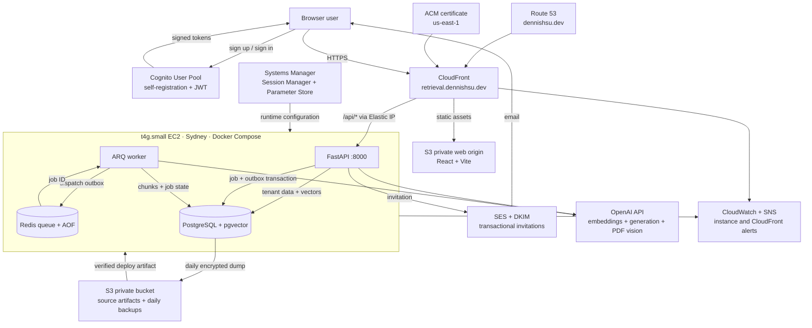

# AWS demo deployment

The canonical application hostname is `retrieval.dennishsu.dev`. Route 53 owns
the public DNS zone, ACM issues the CloudFront certificate in `us-east-1`, and
the distribution redirects viewers to HTTPS. Cognito callback and logout URLs
use the canonical hostname rather than the generated `cloudfront.net` address.

## Goal and budget

Phase 10 targets an always-available learning demo in Sydney with a user limit
of AUD 50 per month and an AWS budget of USD 30. The architecture optimizes for
explainability and cost control rather than high availability.

## Deployed topology

The SPA uses a Retrieval Works-native authentication UI while the official Amplify Auth
client performs SRP, confirmation, recovery, and token refresh directly with
Cognito. It sends the resulting access token to FastAPI. FastAPI verifies its RS256
signature, issuer, expiry, `token_use=access`, client ID, and subject against
Cognito JWKS. A valid
token proves identity only. On first login, authenticated bootstrap creates an
isolated personal workspace; every later request must still have database
membership for the requested `X-Workspace-ID`.

There is no inbound SSH rule. AWS Systems Manager Session Manager uses the EC2
instance role for administration. Port 8000 accepts only the AWS-managed
CloudFront origin-facing prefix list. PostgreSQL and Redis remain internal to
the Docker network.

## Cost gate

Prices were queried from the official AWS Price List API on 2026-09-14 for
`ap-southeast-2`:

| Item | Unit price | 30-day planning amount |
| --- | ---: | ---: |
| Linux `t4g.small` On-Demand | USD 0.0212/hour | USD 15.48 |
| gp3 storage | USD 0.096/GB-month | USD 2.88 for 30 GiB |
| Public IPv4, S3, CloudFront, snapshots, and logs | variable | reserve remaining budget |

Cognito's direct-sign-in free tier covers 10,000 monthly active users for new
accounts, CloudWatch includes 10 standard alarm metrics, and SNS includes the
first 1,000 email deliveries per month. This demo creates one user, one alarm,
and only incident notifications, so these components should remain within
their published free tiers; usage and pricing can still change.

Terraform refuses instance types above `t4g.small`, root disks above 30 GiB,
or a configured budget above USD 30 without a code change and review. Budget
alerts trigger at 50% actual, 80% forecast, and 100% actual. An AWS Budget is a
notification control, not a guaranteed resource kill switch.

## Explicit trade-offs

- EC2 is a single point of failure and deploys may cause downtime.
- PostgreSQL backup to private S3 and a tested restore procedure are required
  before treating the instance as the source of retained demo data.
- The root volume is deleted with the instance to avoid surprise orphan-volume
  charges; durable recovery must come from backups, not an abandoned disk.
- Route 53 and ACM provide the canonical HTTPS hostname without an Application
  Load Balancer. CloudFront remains the only public application entry point.
- The EC2 instance status alarm notifies through SNS after two failed five-minute
  checks. The email subscription must be confirmed before it can deliver.
- A separate CloudFront alarm notifies when the average 5xx error rate reaches
  5% for two consecutive five-minute periods. Missing traffic is healthy for
  this intentionally low-traffic demo.
- The public EC2 subnet avoids a NAT Gateway. Security groups deny arbitrary
  inbound traffic, but outbound model-provider access remains allowed.

## Runtime and recovery implementation

The production Compose definition does not mount source code or expose database
ports. It enables Redis AOF persistence, waits for PostgreSQL/Redis health,
runs Alembic as a deployment gate, and starts Uvicorn without development
reload. EC2 reads runtime secrets from `/retrieval-works/demo` in SSM through its
instance role. This includes a generated, independently scoped bearer token for
the protected Prometheus-format `/metrics` endpoint; the token is never sent to
the React application.

A daily systemd timer creates a PostgreSQL custom-format dump and uploads it to
the private backup bucket. Restore requires an exact object URI and explicit
`CONFIRM_RESTORE=yes`, stops API and worker, validates the archive, restores,
reapplies migrations, and restarts the services. The timer is installed and
active in production; the destructive restore procedure remains unverified
until a disposable AWS rehearsal succeeds.

Production deployment packages one Git commit as a private S3 source artifact,
records its SHA-256 checksum, and grants the instance role read access only to
the artifact prefix. EC2 verifies the checksum before extraction, runs Alembic
as a gate, and then starts the production Compose services. The deployed host
has passed local health and protected-metrics checks, CloudFront API health, and
automatic container recovery after an EC2 stop/start.
